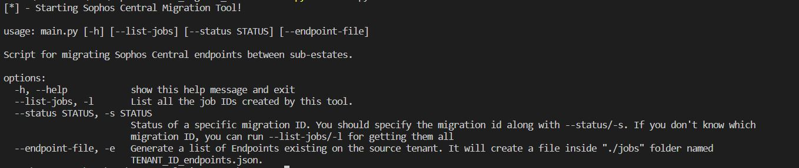

Versão em português: 

## What is Sophos Central Migration Tool?

A tool created for users easily consume Sophos migration API: https://developer.sophos.com/docs/endpoint-v1/1/routes/migrations/get  

## How do I install Sophos Central Migration Tool?

Be sure you have at least Python 3.8 and PIP (https://pypi.org/project/pip/) installed.

After downloading this tool, use pip for installing dependencies using the following command:

`pip3 install -r requirements.txt`

## How do I use Sophos Central Migration Tool?

First of all, go to **/config** folder and rename the **credentials.ini.default** to **credentials.ini**.
Create credentials Client ID and Client SECRET for both, **source** and **destination** Central instances, and define it on credentials.ini file.

Credentials keys should be created with "Service Principal Super Admin" rights, otherwise you'll get a "Forbidden" message as a return.

Use this documentation for learning how to get these credentials.

https://docs.sophos.com/central/Customer/help/en-us/central/Customer/tasks/ep_APICredentials.html

Enable migration on Sophos Central on Global Settings > Endpoint Migrations and define an expiration date (recommended).

In the same folder, there's now a file called **config.ini**. You'll have some options for it.
The most important are the settings on which type of migration you want to permit. 
Options available today:
 - Migrating Endpoints
 - Migrating Computer Groups
 - Migrating Policies 
 - Migrating Global Exclusions
 - Migrating Firewall Groups (future use)
 - Default job's folder

Then you will be all set to run this tool.

This tool contains the some command line arguments, such as:

* *-h*: show help message 
* *-l/--list-jobs*: List all jobs created on Destination tenant
* *-s/--status*: Get status from a specific job ID
* *-e/--endpoint-file*: This option will generate a list of all endpoints in "Jobs" folder. This json file could be modified in order to define only the endpoints that should be migrated. After editing this file, you can run the script again with no arguments to create a job with the new endpoints list.

If none of these options have been passed on the command line, it will run the migration on all endpoints in source tenant.

After that, you'll be able to get status for each endpoint migration.

## How to provide feedback or reporting bugs?

You can e-mail me at rafael (.) foster at sophos (.) com.

Enjoy it!

